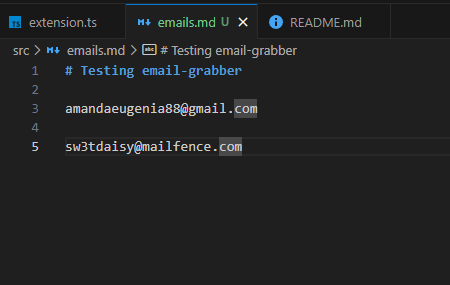
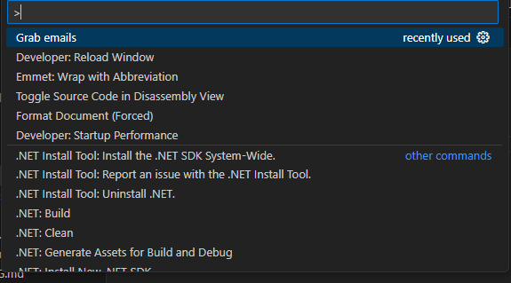
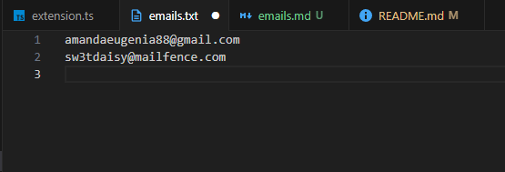
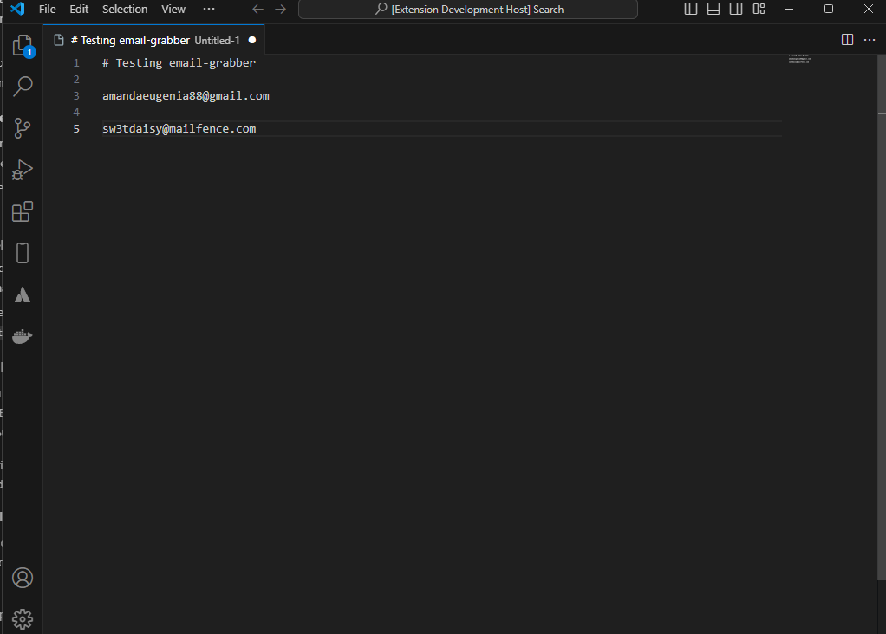
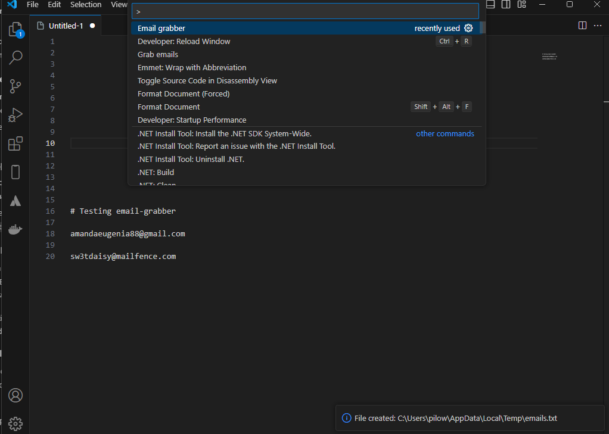
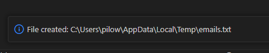

# Email Grabber

Email Grabber is a Visual Studio Code extension designed to extract email addresses from text documents effortlessly. Inspired by the work of JosephDembele95, this tool scans the active editor for any email addresses and compiles them into a new text file for easy access. Whether you're gathering contact information or organizing your emails, Email Grabber streamlines the process, making it simple and efficient.

## Using JosephDembele95's extension

Here we can see that the extension successfully identifies and lists email addresses from the opened document.

After using ctrl + shift + p, you can search by the name of the tool, and after selecting, a .txt file is open with all the emails:

## Using my extension
My extension effectively extracts emails from the document and saves them in a new .txt file ass well.

After running F5, another window is opened, and we can extract the emails to another file:

Wen can see that not only another file is created, but also, a message is shown below, indicating where the file was saved:

